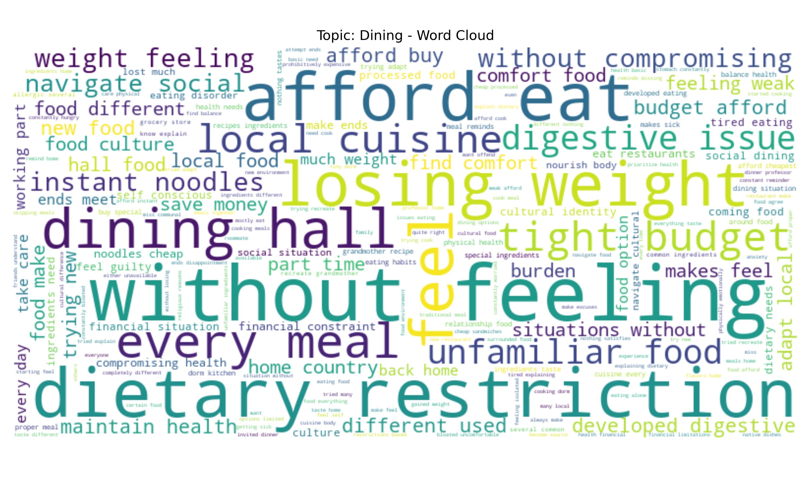

# International Students Psychological Issues Intent Recognition

## Updates
- **Fourth Update**: Implemented intent recognition model training and evaluation pipeline with logistic regression classifier, achieving 97.68% accuracy
- **Third Update**: Added data encoding functionality using jinaai/jina-embeddings-v2-small-en model to convert text data into vector representations
- **Second Update**: Enhanced preprocessing pipeline with duplicate value processing, comprehensive text analysis, background information analysis, and data cleaning
- **First Update**: Basic preprocessing pipeline with data loading, statistical analysis, and missing values analysis

## Project Overview

This project focuses on identifying psychological issues intent recognition for international students. The collected data aims to classify student concerns into five main categories: Studying, Socializing, Dining, Commuting, and Other.

### Data Collection

The dataset was collected through an online questionnaire survey conducted over a period of more than six months. This comprehensive approach allowed us to gather a diverse range of psychological concerns and challenges faced by international students in their daily lives.

## Project Structure

```
.
├── data/                    # Contains the dataset files
├── data_exploration/        # Outputs from data analysis
├── outputs/                # Output files from data encoding and model processing
│   ├── models/             # Saved models and encoders
│   ├── results/            # Model evaluation results and visualizations
│   └── encoded_data.jsonl  # Encoded data with embeddings
├── preprocessing/           # Data preprocessing modules
├── data_encoder.py          # Data encoding script using jinaai embeddings model
├── main_preprocessing.py    # Main preprocessing script
├── main_intent_recognition.py # Main intent recognition pipeline
├── model_training.py        # Model training functionality
└── model_evaluation.py      # Model evaluation functionality
```

## Data Analysis Results

### Dataset Overview
- **Original dataset size**: 24,683 entries
- **After cleaning**: 20,033 entries (removed 2,490 rows with missing values and 2,160 duplicates)
- **Columns**: topic, background, monologue

### Missing Values Analysis


### Topic Distribution
The dataset is evenly distributed across five categories:
- **Socializing**: 4,983 entries (20.2%)
- **Other**: 4,942 entries (20.0%)
- **Commuting**: 4,938 entries (20.0%)
- **Studying**: 4,925 entries (20.0%)
- **Dining**: 4,895 entries (19.8%)


### Background Information
- **Degree distribution**: PhD Students (9,024), Undergraduate (7,855), Master's Students (7,804)
- **Personality distribution**: Extroverted (12,990), Introverted (11,693)
- **Country distribution**: United Kingdom (8,260), Australia (8,244), United States (8,179)
- **Financial status**: Comfortable (12,459), Strained (12,224)


### Text Analysis
- **Average monologue length**: 275.8 characters
- **Most common words across all topics**: feel, like, without, home, constantly, every, time, academic, food, feeling
- **Topic-specific keywords**:
  - **Studying**: academic, research, supervisor, struggling
  - **Socializing**: social, friends, connections, cultural
  - **Commuting**: every, day, campus, transportation, commute
  - **Other**: home, family, health, visa, country
  - **Dining**: food, meals, afford, eat, ingredients


#### Topic-Specific Word Analysis

##### Studying


##### Socializing


##### Commuting


##### Other


##### Dining



## Intent Categories

The project classifies psychological issues of international students into the following categories:

1. **Studying**: Issues related to academic challenges, course workload, examinations, etc.
2. **Socializing**: Difficulties in making friends, cultural adaptation, social interactions, etc.
3. **Dining**: Problems with food availability, dietary restrictions, food preferences, etc.
4. **Commuting**: Transportation issues, navigating new places, commuting challenges, etc.
5. **Other**: Miscellaneous concerns that don't fall into the above categories.

## Current Implementation

The project now includes a comprehensive preprocessing, encoding, and intent recognition pipeline that performs:

### Preprocessing Pipeline
1. **Data Loading**: Loads data from JSONL format
2. **Basic Statistical Analysis**: Provides fundamental insights into the dataset
3. **Missing Values Analysis**: Identifies and analyzes missing data points
4. **Duplicate Values Analysis**: Detects and removes duplicate entries
5. **Topic Distribution Analysis**: Analyzes distribution across intent categories
6. **Text Length Analysis**: Examines text length patterns in monologues
7. **Background Information Analysis**: Analyzes demographic and background data
8. **Text Content Analysis**: Identifies common words and patterns in monologues
9. **Data Cleaning**: Removes missing values and duplicates, saves cleaned dataset

### Data Encoding Pipeline
1. **Model Loading**: Loads the jinaai/jina-embeddings-v2-small-en model for text encoding
2. **Text Encoding**: Converts monologue texts into vector representations using the embedding model
3. **Batch Processing**: Processes texts in batches for efficient encoding
4. **Output Generation**: Saves encoded data along with labels and metadata in JSONL format

The data encoding functionality is implemented in `data_encoder.py`, which:
- Uses the jinaai/jina-embeddings-v2-small-en model to create vector representations of text
- Processes data in batches for efficiency
- Preserves topic labels and metadata alongside the encoded vectors
- Outputs the results to the `outputs/encoded_data.jsonl` file

### Model Training Pipeline
1. **Data Loading**: Loads encoded data from JSONL format
2. **Data Preparation**: Splits data into training and testing sets, encodes labels
3. **Model Training**: Trains a logistic regression classifier for intent recognition
4. **Model Saving**: Saves the trained model and label encoder for future use

The model training functionality is implemented in `model_training.py`, which:
- Loads encoded data and prepares it for training
- Uses scikit-learn's LogisticRegression for classification
- Implements stratified train-test splitting to maintain class distribution
- Saves the trained model and label encoder to the `outputs/models/` directory

### Model Evaluation Pipeline
1. **Model Evaluation**: Evaluates the trained model using various metrics
2. **Results Visualization**: Creates confusion matrix and classification report visualizations
3. **Results Saving**: Saves evaluation results and visualizations for future reference

The model evaluation functionality is implemented in `model_evaluation.py`, which:
- Calculates accuracy, precision, recall, and F1 score
- Generates confusion matrix and classification report visualizations
- Saves evaluation results to `outputs/results/evaluation_results.json`
- Saves visualizations as PNG files in the `outputs/results/` directory

### Main Intent Recognition Pipeline
The `main_intent_recognition.py` file orchestrates the entire process:
1. Data encoding using the jinaai embeddings model
2. Model training with logistic regression
3. Model evaluation and results visualization

This integrated pipeline provides a complete workflow from raw text data to a trained and evaluated intent recognition model.

## Future Work

The project will be expanded to include:

### Completed
- Text encoding using jinaai/jina-embeddings-v2-small-en model
- Model training for intent classification using logistic regression
- Model evaluation and performance analysis with visualization

### In Progress
- None

### Planned
- Feature engineering for enhanced model performance
- Model optimization and hyperparameter tuning
- Experiment with different classification algorithms (e.g., SVM, Random Forest, Neural Networks)
- Deployment options for practical use
- Integration with university support systems
- Real-time intent recognition API development

## How to Use

### Preprocessing Pipeline
To run the preprocessing pipeline:

```bash
python main_preprocessing.py
```

This will execute the current preprocessing steps and save the analysis results in the `data_exploration` directory.

### Data Encoding
To encode the cleaned data using the jinaai embeddings model:

```bash
python data_encoder.py
```

This will:
1. Load the cleaned data from `data_exploration/cleaned_data.jsonl`
2. Encode the monologue texts using the jinaai/jina-embeddings-v2-small-en model
3. Save the encoded data along with labels and metadata to `outputs/encoded_data.jsonl`

Note: The encoding process may take some time depending on the size of your dataset and available computing resources.

### Intent Recognition Pipeline
To run the complete intent recognition pipeline (data encoding, model training, and evaluation):

```bash
python main_intent_recognition.py
```

This will:
1. Encode the data using the jinaai embeddings model (if not already encoded)
2. Train a logistic regression model for intent classification
3. Evaluate the model performance and generate visualizations
4. Save the trained model to `outputs/models/intent_model.pkl`
5. Save the evaluation results to `outputs/results/evaluation_results.json`
6. Save visualization images to `outputs/results/`

### Using the Trained Model
To use the trained model for prediction:

```python
import numpy as np
from model_training import load_model
from data_encoder import encode_text

# Load the trained model and label encoder
model, label_encoder = load_model('outputs/models')

# Example text to classify
text = "I'm struggling to make friends in my new university."

# Encode the text
embedding = encode_text(text)

# Make prediction
prediction = model.predict([embedding])
predicted_class = label_encoder.inverse_transform(prediction)[0]

print(f"Predicted intent: {predicted_class}")
```

Note: You would need to implement the `encode_text` function in `data_encoder.py` to encode individual text samples.

## Model Evaluation Results

The intent recognition model has been evaluated on a test set of 4,007 samples, achieving excellent performance across all intent categories:

### Overall Performance Metrics
- **Accuracy**: 97.68%
- **Precision**: 97.68%
- **Recall**: 97.68%
- **F1 Score**: 97.68%

### Performance by Intent Category
- **Commuting**: Precision 99.88%, Recall 99.63%, F1-Score 99.75%
- **Dining**: Precision 99.75%, Recall 99.75%, F1-Score 99.75%
- **Other**: Precision 95.82%, Recall 94.86%, F1-Score 95.33%
- **Socializing**: Precision 96.06%, Recall 97.14%, F1-Score 96.60%
- **Studying**: Precision 96.86%, Recall 96.98%, F1-Score 96.92%


The model demonstrates high accuracy across all intent categories, with particularly strong performance for "Commuting" and "Dining" categories. The slightly lower performance for the "Other" category is expected, as this category contains a more diverse range of concerns that may not be as clearly distinguishable.

## Project Impact & Significance

This project represents an important contribution to understanding and addressing the psychological challenges faced by international students. By systematically categorizing and analyzing these concerns, we aim to:

- **Improve Support Systems**: Enable universities and support organizations to better tailor their services to address the specific needs of international students.
- **Early Intervention**: Facilitate early identification of students who may need additional support, potentially preventing more serious psychological issues.
- **Resource Allocation**: Help institutions allocate resources more effectively by understanding the most common and pressing concerns.
- **Research Contribution**: Provide valuable data for researchers studying cross-cultural psychology and student well-being.
- **Policy Development**: Inform policy decisions related to international student programs and support services.

The technical expertise demonstrated in this project spans data collection, preprocessing, analysis, and machine learning application to real-world psychological challenges, showcasing a comprehensive approach to solving complex social issues through technology. The high accuracy of the intent recognition model (97.68%) demonstrates the potential for practical implementation in university support systems.


