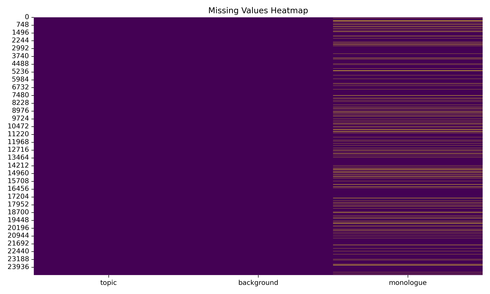
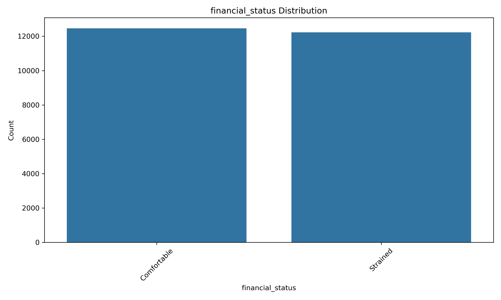
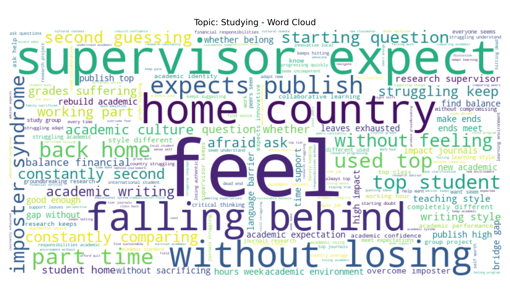

# International Students Psychological Issues Intent Recognition

## Updates
- *Latest update*: Enhanced preprocessing pipeline with duplicate value processing, comprehensive text analysis, background information analysis, and data cleaning
- *Initial release*: Basic preprocessing pipeline with data loading, statistical analysis, and missing values analysis

## Project Overview

This project focuses on identifying psychological issues intent recognition for international students. The collected data aims to classify student concerns into five main categories: Studying, Socializing, Dining, Commuting, and Other.

### Data Collection

The dataset was collected through an online questionnaire survey conducted over a period of more than six months. This comprehensive approach allowed us to gather a diverse range of psychological concerns and challenges faced by international students in their daily lives.

## Project Structure

```
.
├── data/                    # Contains the dataset files
├── data_exploration/        # Outputs from data analysis
├── preprocessing/           # Data preprocessing modules
└── main_preprocessing.py    # Main preprocessing script
```

## Data Analysis Results

### Dataset Overview
- **Original dataset size**: 24,683 entries
- **After cleaning**: 20,033 entries (removed 2,490 rows with missing values and 2,160 duplicates)
- **Columns**: topic, background, monologue

### Missing Values Analysis


### Topic Distribution
The dataset is evenly distributed across five categories:
- **Socializing**: 4,983 entries (20.2%)
- **Other**: 4,942 entries (20.0%)
- **Commuting**: 4,938 entries (20.0%)
- **Studying**: 4,925 entries (20.0%)
- **Dining**: 4,895 entries (19.8%)


### Background Information
- **Degree distribution**: PhD Students (9,024), Undergraduate (7,855), Master's Students (7,804)
- **Personality distribution**: Extroverted (12,990), Introverted (11,693)
- **Country distribution**: United Kingdom (8,260), Australia (8,244), United States (8,179)
- **Financial status**: Comfortable (12,459), Strained (12,224)




### Text Analysis
- **Average monologue length**: 275.8 characters
- **Most common words across all topics**: feel, like, without, home, constantly, every, time, academic, food, feeling
- **Topic-specific keywords**:
  - **Studying**: academic, research, supervisor, struggling
  - **Socializing**: social, friends, connections, cultural
  - **Commuting**: every, day, campus, transportation, commute
  - **Other**: home, family, health, visa, country
  - **Dining**: food, meals, afford, eat, ingredients


#### Topic-Specific Word Analysis

##### Studying



##### Socializing


##### Commuting


##### Other


##### Dining


## Intent Categories

The project classifies psychological issues of international students into the following categories:

1. **Studying**: Issues related to academic challenges, course workload, examinations, etc.
2. **Socializing**: Difficulties in making friends, cultural adaptation, social interactions, etc.
3. **Dining**: Problems with food availability, dietary restrictions, food preferences, etc.
4. **Commuting**: Transportation issues, navigating new places, commuting challenges, etc.
5. **Other**: Miscellaneous concerns that don't fall into the above categories.

## Current Implementation

The project now includes a comprehensive preprocessing pipeline that performs:

1. **Data Loading**: Loads data from JSONL format
2. **Basic Statistical Analysis**: Provides fundamental insights into the dataset
3. **Missing Values Analysis**: Identifies and analyzes missing data points
4. **Duplicate Values Analysis**: Detects and removes duplicate entries
5. **Topic Distribution Analysis**: Analyzes distribution across intent categories
6. **Text Length Analysis**: Examines text length patterns in monologues
7. **Background Information Analysis**: Analyzes demographic and background data
8. **Text Content Analysis**: Identifies common words and patterns in monologues
9. **Data Cleaning**: Removes missing values and duplicates, saves cleaned dataset

## Future Work

The project will be expanded to include:

- Text content updates and normalization
- Feature engineering for model training
- Model training for intent classification
- Evaluation metrics and performance analysis
- Deployment options for practical use

## How to Use

To run the preprocessing pipeline:

```bash
python main_preprocessing.py
```

This will execute the current preprocessing steps and save the analysis results in the `data_exploration` directory.

## Project Impact & Significance

This project represents an important contribution to understanding and addressing the psychological challenges faced by international students. By systematically categorizing and analyzing these concerns, we aim to:

- **Improve Support Systems**: Enable universities and support organizations to better tailor their services to address the specific needs of international students.
- **Early Intervention**: Facilitate early identification of students who may need additional support, potentially preventing more serious psychological issues.
- **Resource Allocation**: Help institutions allocate resources more effectively by understanding the most common and pressing concerns.
- **Research Contribution**: Provide valuable data for researchers studying cross-cultural psychology and student well-being.
- **Policy Development**: Inform policy decisions related to international student programs and support services.

The technical expertise demonstrated in this project spans data collection, preprocessing, analysis, and machine learning application to real-world psychological challenges, showcasing a comprehensive approach to solving complex social issues through technology.


